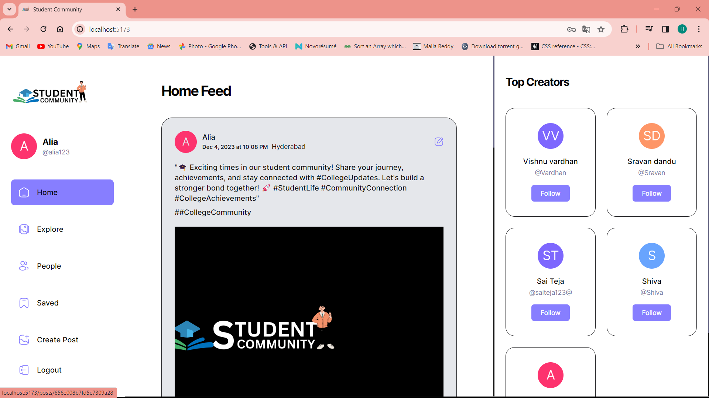
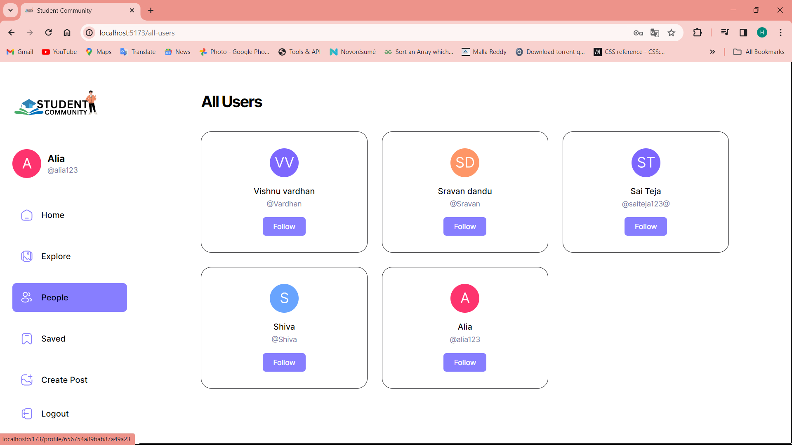

## 📋 <a name="table">Table of Contents</a>

1. 🤖 [Introduction](#introduction)
2. ⚙️ [Tech Stack](#tech-stack)
3. 🔋 [Features](#features)
4. 🤸 [Quick Start](#quick-start)
5. 🕸️ [Snippets](#snippets)
6. 🔗 [Student Community Website](#Student Community Website)

## <a name="introduction">🤖 Introduction</a>

Explore social media with this user-friendly platform that has a nice look and lots of features. Easily create and explore posts, and enjoy a strong authentication system and quick data fetching using React Query for a smooth user experience.


## <a name="tech-stack">⚙️ Tech Stack</a>

- React.js
- Appwrite
- React Query
- TypeScript
- Shadcn
- Tailwind CSS


## <a name="quick-start">🤸 Quick Start</a>

Follow these steps to set up the project locally on your machine.
**Prerequisites**

Make sure you have the following installed on your machine:

- [Git](https://git-scm.com/)
- [Node.js](https://nodejs.org/en)
- [npm](https://www.npmjs.com/) (Node Package Manager)

**Cloning the Repository**

```bash
git clone https://github.com/adrianhajdin/social_media_app.git
cd social_media_app
```

**Installation**

Install the project dependencies using npm:

```bash
npm install
```

**Set Up Environment Variables**

Create a new file named `.env` in the root of your project and add the following content:

```env
VITE_APPWRITE_URL=
VITE_APPWRITE_PROJECT_ID=
VITE_APPWRITE_DATABASE_ID=
VITE_APPWRITE_STORAGE_ID=
VITE_APPWRITE_USER_COLLECTION_ID=
VITE_APPWRITE_POST_COLLECTION_ID=
VITE_APPWRITE_SAVES_COLLECTION_ID=
```

**Running the Project**

```bash
npm start or npm run dev
```


- ## <a name="features">🔋 Features</a>
 

 Mentorship Program: 
      Students can connect with senior students for guidance, advice, and support. This program can help them navigate academic challenges, explore career options, and develop important skills.
      Event Management: Students can organize and participate in events around their interests. This could include academic workshops, social gatherings, guest speaker sessions, or club meetings.
      Clubs and Organizations: Students can form or join clubs and organizations based on their interests. This is a great way to connect with like-minded peers, collaborate on projects, and develop leadership skills.
      Resource Hub: The website provides a central location for students to find a variety of resources, such as:
      Study materials, including lecture notes, practice problems, and past exams.
      Scholarship opportunities to help finance their education.
      Internship listings to gain valuable work experience.
      Communication Tools: Students can chat with each other one-on-one or in groups. This allows them to study together, share ideas, and build relationships. The platform can also facilitate the creation of forums or discussion boards on specific topics.

Benefits:
      Academic Success: By connecting with mentors and peers, students can get the support they need to excel academically.
      Personal Growth: The website provides opportunities for students to develop important life skills, such as communication, teamwork, and leadership.
      Sense of Community: Students can connect with others who share their interests and experiences, fostering a sense of belonging and reducing feelings of isolation.

User Authentication
    The student community website utilizes a secure user authentication system to ensure a safe and controlled environment. This system allows students to create accounts and manage their profiles.

Replace the placeholder values with your actual Appwrite credentials. You can obtain these credentials by signing up on the [Appwrite website](https://appwrite.io/).


## <a name="snippets">🕸️ Snippets</a>

<details>
<summary><code>constants.index.ts</code></summary>

```typescript
export const sidebarLinks = [
  {
    imgURL: "/assets/icons/home.svg",
    route: "/",
    label: "Home",
  },
  {
    imgURL: "/assets/icons/wallpaper.svg",
    route: "/explore",
    label: "Explore",
  },
  {
    imgURL: "/assets/icons/people.svg",
    route: "/all-users",
    label: "People",
  },
  {
    imgURL: "/assets/icons/bookmark.svg",
    route: "/saved",
    label: "Saved",
  },
  {
    imgURL: "/assets/icons/gallery-add.svg",
    route: "/create-post",
    label: "Create Post",
  },
];

export const bottombarLinks = [
  {
    imgURL: "/assets/icons/home.svg",
    route: "/",
    label: "Home",
  },
  {
    imgURL: "/assets/icons/wallpaper.svg",
    route: "/explore",
    label: "Explore",
  },
  {
    imgURL: "/assets/icons/bookmark.svg",
    route: "/saved",
    label: "Saved",
  },
  {
    imgURL: "/assets/icons/gallery-add.svg",
    route: "/create-post",
    label: "Create",
  },
];
```

</details>

<details>
<summary><code>globals.css</code></summary>

```css
@import url("https://fonts.googleapis.com/css2?family=Inter:wght@400;500;600;700;800&display=swap");

@tailwind base;
@tailwind components;
@tailwind utilities;

@layer base {
  * {
    @apply box-border list-none p-0 m-0 scroll-smooth;
  }

  body {
    @apply bg-dark-1 text-white min-h-screen font-inter;
  }
}

@layer utilities {
  /* TYPOGRAPHY */
  .h1-bold {
    @apply text-[36px] font-bold leading-[140%] tracking-tighter;
  }

  .h1-semibold {
    @apply text-[36px] font-semibold leading-[140%] tracking-tighter;
  }

  .h2-bold {
    @apply text-[30px] font-bold leading-[140%] tracking-tighter;
  }

  .h3-bold {
    @apply text-[24px] font-bold leading-[140%] tracking-tighter;
  }

  .base-semibold {
    @apply text-[16px] font-semibold leading-[140%] tracking-tighter;
  }

  .base-medium {
    @apply text-[16px] font-medium leading-[140%];
  }

  .base-regular {
    @apply text-[16px] font-normal leading-[140%];
  }

  .body-bold {
    @apply text-[18px] font-bold leading-[140%];
  }

  .body-medium {
    @apply text-[18px] font-medium leading-[140%];
  }

  .small-semibold {
    @apply text-[14px] font-semibold leading-[140%] tracking-tighter;
  }

  .small-medium {
    @apply text-[14px] font-medium leading-[140%];
  }

  .small-regular {
    @apply text-[14px] font-normal leading-[140%];
  }

  .subtle-semibold {
    @apply text-[12px] font-semibold leading-[140%];
  }

  .tiny-medium {
    @apply text-[10px] font-medium leading-[140%];
  }

  /* UTILITIES */
  .invert-white {
    @apply invert brightness-0 transition;
  }

  .flex-center {
    @apply flex justify-center items-center;
  }

  .flex-between {
    @apply flex justify-between items-center;
  }

  .flex-start {
    @apply flex justify-start items-center;
  }

  .custom-scrollbar::-webkit-scrollbar {
    width: 3px;
    height: 3px;
    border-radius: 2px;
  }

  .custom-scrollbar::-webkit-scrollbar-track {
    background: #09090a;
  }

  .custom-scrollbar::-webkit-scrollbar-thumb {
    background: #5c5c7b;
    border-radius: 50px;
  }

  .custom-scrollbar::-webkit-scrollbar-thumb:hover {
    background: #7878a3;
  }

  .common-container {
    @apply flex flex-col flex-1 items-center gap-10 overflow-scroll py-10 px-5 md:px-8 lg:p-14 custom-scrollbar;
  }

  /* All Users */
  .user-container {
    @apply max-w-5xl flex flex-col items-start w-full gap-6 md:gap-9;
  }

  .user-grid {
    @apply w-full grid grid-cols-1 xs:grid-cols-2 md:grid-cols-2 lg:grid-cols-2 xl:grid-cols-3 gap-7 max-w-5xl;
  }

  /* Explore */
  .explore-container {
    @apply flex flex-col flex-1 items-center overflow-scroll py-10 px-5 md:p-14 custom-scrollbar;
  }

  .explore-inner_container {
    @apply max-w-5xl flex flex-col items-center w-full gap-6 md:gap-9;
  }

  .explore-search {
    @apply h-12 bg-dark-4 border-none placeholder:text-light-4 focus-visible:ring-0 focus-visible:ring-offset-0 ring-offset-0 !important;
  }

  /* Home */
  .home-container {
    @apply flex flex-col flex-1 items-center gap-10 overflow-scroll py-10 px-5 md:px-8 lg:p-14 custom-scrollbar;
  }

  .home-posts {
    @apply max-w-screen-sm flex flex-col items-center w-full gap-6 md:gap-9;
  }

  .home-creators {
    @apply hidden xl:flex flex-col w-72 2xl:w-465 px-6 py-10 gap-10  overflow-scroll custom-scrollbar;
  }

  /* Post Details */
  .post_details-container {
    @apply flex flex-col flex-1 gap-10 overflow-scroll py-10 px-5 md:p-14 custom-scrollbar items-center;
  }

  .post_details-card {
    @apply bg-dark-2 w-full max-w-5xl rounded-[30px] flex-col flex xl:flex-row border border-dark-4 xl:rounded-l-[24px];
  }

  .post_details-img {
    @apply h-80 lg:h-[480px] xl:w-[48%] rounded-t-[30px] xl:rounded-l-[24px] xl:rounded-tr-none object-cover p-5 bg-dark-1;
  }

  .post_details-info {
    @apply bg-dark-2 flex flex-col gap-5 lg:gap-7 flex-1 items-start p-8 rounded-[30px];
  }

  .post_details-delete_btn {
    @apply p-0 flex gap-3 hover:bg-transparent hover:text-light-1  text-light-1 small-medium lg:base-medium;
  }

  /* Profile */
  .profile-container {
    @apply flex flex-col items-center flex-1 gap-10 overflow-scroll py-10 px-5 md:p-14 custom-scrollbar;
  }

  .profile-inner_container {
    @apply flex items-center md:mb-8 xl:items-start gap-8 flex-col xl:flex-row relative max-w-5xl w-full;
  }

  .profile-tab {
    @apply flex-center gap-3 py-4 w-48 bg-dark-2  transition flex-1 xl:flex-initial;
  }

  /* Saved */
  .saved-container {
    @apply flex flex-col flex-1 items-center gap-10 overflow-scroll py-10 px-5 md:p-14 custom-scrollbar;
  }

  /* Bottom bar */
  .bottom-bar {
    @apply z-50 flex-between w-full sticky bottom-0 rounded-t-[20px] bg-dark-2 px-5 py-4 md:hidden;
  }

  /* File uploader */
  .file_uploader-img {
    @apply h-80 lg:h-[480px] w-full rounded-[24px] object-cover object-top;
  }

  .file_uploader-label {
    @apply text-light-4 text-center small-regular w-full p-4 border-t border-t-dark-4;
  }

  .file_uploader-box {
    @apply flex-center flex-col p-7 h-80 lg:h-[612px];
  }

  /* Grid Post List */
  .grid-container {
    @apply w-full grid grid-cols-1 sm:grid-cols-2 md:grid-cols-1 lg:grid-cols-2 xl:grid-cols-3 gap-7 max-w-5xl;
  }

  .grid-post_link {
    @apply flex rounded-[24px] border border-dark-4 overflow-hidden cursor-pointer w-full h-full;
  }

  .grid-post_user {
    @apply absolute bottom-0 p-5 flex-between w-full bg-gradient-to-t from-dark-3 to-transparent rounded-b-[24px] gap-2;
  }

  /* Left sidebar */
  .leftsidebar {
    @apply hidden md:flex px-6 py-10 flex-col justify-between min-w-[270px] bg-dark-2;
  }

  .leftsidebar-link {
    @apply rounded-lg base-medium hover:bg-primary-500 transition;
  }

  /* Post Card */
  .post-card {
    @apply bg-dark-2 rounded-3xl border border-dark-4 p-5 lg:p-7 w-full max-w-screen-sm;
  }

  .post-card_img {
    @apply h-64 xs:h-[400px] lg:h-[450px] w-full rounded-[24px] object-cover mb-5;
  }

  /* Topbar */
  .topbar {
    @apply sticky top-0 z-50 md:hidden bg-dark-2 w-full;
  }

  /* User card */
  .user-card {
    @apply flex-center flex-col gap-4 border border-dark-4 rounded-[20px] px-5 py-8;
  }
}

@layer components {
  /* SHADCN COMPONENTS */
  /* Form */
  .shad-form_label {
    @apply text-white !important;
  }

  .shad-form_message {
    @apply text-red !important;
  }

  .shad-input {
    @apply h-12 bg-dark-4 border-none placeholder:text-light-4 focus-visible:ring-1 focus-visible:ring-offset-1 ring-offset-light-3 !important;
  }

  .shad-textarea {
    @apply h-36 bg-dark-3 rounded-xl border-none focus-visible:ring-1 focus-visible:ring-offset-1 ring-offset-light-3 !important;
  }

  /* Button */
  .shad-button_primary {
    @apply bg-primary-500 hover:bg-primary-500 text-light-1 flex gap-2 !important;
  }

  .shad-button_dark_4 {
    @apply h-12 bg-dark-4 px-5 text-light-1 flex gap-2 !important;
  }

  .shad-button_ghost {
    @apply flex gap-4 items-center justify-start hover:bg-transparent hover:text-white !important;
  }
}
```

</details>


<details>
<summary><code>queryKeys.ts</code></summary>

```typescript
export enum QUERY_KEYS {
  // AUTH KEYS
  CREATE_USER_ACCOUNT = "createUserAccount",

  // USER KEYS
  GET_CURRENT_USER = "getCurrentUser",
  GET_USERS = "getUsers",
  GET_USER_BY_ID = "getUserById",

  // POST KEYS
  GET_POSTS = "getPosts",
  GET_INFINITE_POSTS = "getInfinitePosts",
  GET_RECENT_POSTS = "getRecentPosts",
  GET_POST_BY_ID = "getPostById",
  GET_USER_POSTS = "getUserPosts",
  GET_FILE_PREVIEW = "getFilePreview",

  //  SEARCH KEYS
  SEARCH_POSTS = "getSearchPosts",
}
```

</details>

<details>
<summary><code>tailwind.config.js</code></summary>

```javascript
/** @type {import('tailwindcss').Config} */
const defaultTheme = require('tailwindcss/defaultTheme')

module.exports = {
  darkMode: ['class'],
  content: [
    './pages/**/*.{ts,tsx}',
    './components/**/*.{ts,tsx}',
    './app/**/*.{ts,tsx}',
    './src/**/*.{ts,tsx}',
  ],
  theme: {
    container: {
      center: true,
      padding: '2rem',
      screens: {
        '2xl': '1400px',
      
      },
    },
    extend: {
      colors: {
        'primary-500': '#877EFF',
        'primary-600': '#5D5FEF',
        'secondary-500': '#FFB620',
        'off-white': '#D0DFFF',
        'red': '#FF5A5A',
        'dark-1': '#000000',
        'dark-2': '#09090A',
        'dark-3': '#101012',
        'dark-4': '#1F1F22',
        'light-1': '#FFFFFF',
        'light-2': '#EFEFEF',
        'light-3': '#7878A3',
        'light-4': '#5C5C7B',
      },
      screens: {
        'xs': '480px',
      
      },
      width: {
        '420': '420px',
        '465': '465px',
      },
      fontFamily: {
        inter: ['Inter', 'sans-serif'],

      },
      keyframes: {
        'accordion-down': {
          from: { height: 0 },
          to: { height: 'var(--radix-accordion-content-height)' },
        },
        'accordion-up': {
          from: { height: 'var(--radix-accordion-content-height)' },
          to: { height: 0 },
        },
      },
      animation: {
        'accordion-down': 'accordion-down 0.2s ease-out',
        'accordion-up': 'accordion-up 0.2s ease-out',
      },
    },
  },
  plugins: [require('tailwindcss-animate')],
};
```

</details>

<details>
<summary><code>types.index.ts</code></summary>

```typescript
export type INavLink = {
  imgURL: string;
  route: string;
  label: string;
};

export type IUpdateUser = {
  userId: string;
  name: string;
  bio: string;
  imageId: string;
  imageUrl: URL | string;
  file: File[];
};

export type INewPost = {
  userId: string;
  caption: string;
  file: File[];
  location?: string;
  tags?: string;
};

export type IUpdatePost = {
  postId: string;
  caption: string;
  imageId: string;
  imageUrl: URL;
  file: File[];
  location?: string;
  tags?: string;
};

export type IUser = {
  id: string;
  name: string;
  username: string;
  email: string;
  imageUrl: string;
  bio: string;
};

export type INewUser = {
  name: string;
  email: string;
  username: string;
  password: string;
};
```

</details>

<details>
<summary><code>useDebounce.ts</code></summary>

```typescript
import { useEffect, useState } from "react";

// https://codesandbox.io/s/react-query-debounce-ted8o?file=/src/useDebounce.js
export default function useDebounce<T>(value: T, delay: number): T {
  // State and setters for debounced value
  const [debouncedValue, setDebouncedValue] = useState<T>(value);

  useEffect(() => {
    // Update debounced value after delay
    const handler = setTimeout(() => {
      setDebouncedValue(value);
    }, delay);

    // Cancel the timeout if value changes (also on delay change or unmount)
    // This is how we prevent debounced value from updating if value is changed ...
    // .. within the delay period. Timeout gets cleared and restarted.
    return () => {
      clearTimeout(handler);
    };
  }, [value, delay]); // Only re-call effect if value or delay changes

  return debouncedValue;
}
```

</details>

<details>
<summary><code>utils.ts</code></summary>

```typescript
import { type ClassValue, clsx } from "clsx";
import { twMerge } from "tailwind-merge";

export function cn(...inputs: ClassValue[]) {
  return twMerge(clsx(inputs));
}

export const convertFileToUrl = (file: File) => URL.createObjectURL(file);

export function formatDateString(dateString: string) {
  const options: Intl.DateTimeFormatOptions = {
    year: "numeric",
    month: "short",
    day: "numeric",
  };

  const date = new Date(dateString);
  const formattedDate = date.toLocaleDateString("en-US", options);

  const time = date.toLocaleTimeString([], {
    hour: "numeric",
    minute: "2-digit",
  });

  return `${formattedDate} at ${time}`;
}

// 
export const multiFormatDateString = (timestamp: string = ""): string => {
  const timestampNum = Math.round(new Date(timestamp).getTime() / 1000);
  const date: Date = new Date(timestampNum * 1000);
  const now: Date = new Date();

  const diff: number = now.getTime() - date.getTime();
  const diffInSeconds: number = diff / 1000;
  const diffInMinutes: number = diffInSeconds / 60;
  const diffInHours: number = diffInMinutes / 60;
  const diffInDays: number = diffInHours / 24;

  switch (true) {
    case Math.floor(diffInDays) >= 30:
      return formatDateString(timestamp);
    case Math.floor(diffInDays) === 1:
      return `${Math.floor(diffInDays)} day ago`;
    case Math.floor(diffInDays) > 1 && diffInDays < 30:
      return `${Math.floor(diffInDays)} days ago`;
    case Math.floor(diffInHours) >= 1:
      return `${Math.floor(diffInHours)} hours ago`;
    case Math.floor(diffInMinutes) >= 1:
      return `${Math.floor(diffInMinutes)} minutes ago`;
    default:
      return "Just now";
  }
};

export const checkIsLiked = (likeList: string[], userId: string) => {
  return likeList.includes(userId);
};
```

</details>

 


**Student Community Website**

This is a student community website designed to foster a supportive and collaborative environment for students to learn, grow, and achieve their academic goals. The platform offers a variety of features to connect students with each other, senior mentors, and valuable resources.

**Features:**


Signup:

   Students can register for an account using their student email address and creating a secure password.

Home Page:

  The home page serves as the central hub for student interaction and information access. It provides features that encourage users to post, connect, and discover valuable resources.

People Connect Page - Building Relationships

      The People Connect page plays a crucial role in facilitating connections between students and fostering a supportive community.

      Features:

      Search and Browse Users: Users can search for other students based on various criteria, such as name, major, year of study, or club affiliation. This allows them to find peers with similar interests.
      Profiles: Each user has a profile page where they can share information about themselves, such as their academic interests, hobbies, or skills. This helps others get to know them better and build connections.
      Messaging: The platform offers a secure messaging system for students to chat with each other privately. This allows them to connect with mentors, seek advice from peers, or collaborate on projects.
      Connection Recommendations: The website can utilize algorithms to recommend connections between students based on shared interests, fields of study, or participation in the same clubs or events.


Saved Posts:

    Users can save posts they find interesting or valuable for future reference. This could include:
    Informational posts with study resources or scholarship opportunities.
    Event announcements for activities they're interested in attending.
    Club discussions relevant to their academic or extracurricular interests.
    Saved posts can be categorized or tagged for easier organization and retrieval.


Creating Posts:

    Users can create new posts to share information, initiate discussions, or announce events.
    The platform should offer a user-friendly interface for creating posts, allowing users to:
    Choose the type of content (text, image, video, or link).
    Compose a descriptive title and body for the post.
    Include relevant tags or categories to improve discoverability.
    Mention other users or clubs in the post if applicable.


**We are still working on it to develop complete website like chat rooms,creating pages and many more**
